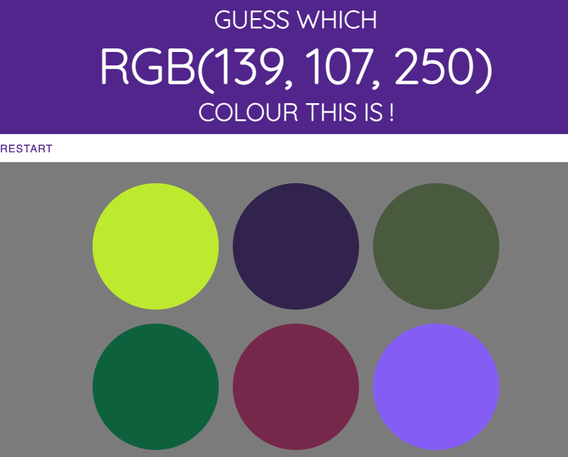

# SE2202 Tutorial 05

The purpose of this tutorial is to create a colour guessing name.
You will set an RGB color and have 6 colours to pick from, you need to i
dentify the RGB colour by clicking on the correct circle. 

You are given the HTML and CSS code and the skeleton of the JS. Fill in the script file as needed. 
You should make sure that your HTML page is published on GitHub Pages and that the game can be played.

Here are some screenshot examples of the expected game: 

Beginning: 

Mid Play:

End:

Pressing the restart button should restart the game at any time and pressing play again should do the same. 
